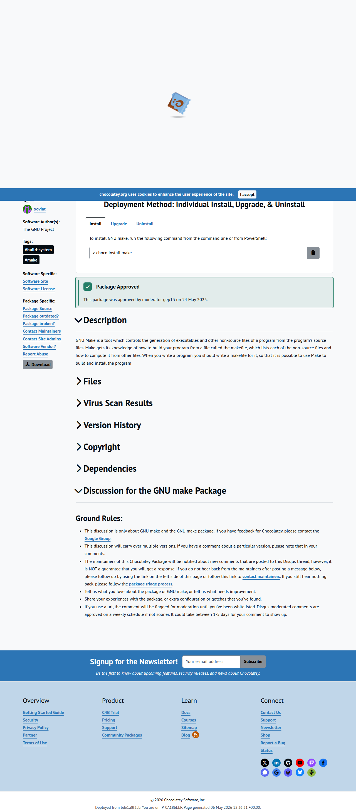

# Visited: https://community.chocolatey.org/packages/make
**Time:** Wed May  6 12:36:39 UTC 2026

## Screenshot

## Raw HTML
[page.html](./page.html)

## Downloaded Media (25 files)
## Downloaded Media Files

- [favicon.ico](./media/favicon.ico) (0 KB)

## Other Links
- [#](#)
- [#ansible](#ansible)
- [#builder-ansible](#builder-ansible)
- [#builder-ansible-chocolatey-configuration](#builder-ansible-chocolatey-configuration)
- [#builder-chef](#builder-chef)
- [#builder-chef-chocolatey-configuration](#builder-chef-chocolatey-configuration)
- [#builder-generic](#builder-generic)
- [#builder-generic-chocolatey-configuration](#builder-generic-chocolatey-configuration)
- [#builder-individual](#builder-individual)
- [#builder-psdsc](#builder-psdsc)
- [#builder-psdsc-chocolatey-configuration](#builder-psdsc-chocolatey-configuration)
- [#builder-puppet](#builder-puppet)
- [#builder-puppet-chocolatey-configuration](#builder-puppet-chocolatey-configuration)
- [#builder-step-1](#builder-step-1)
- [#builder-step-2](#builder-step-2)
- [#builder-step-3](#builder-step-3)
- [#builder-step-4](#builder-step-4)
- [#builder-step-4-option-1](#builder-step-4-option-1)
- [#builder-step-4-option-2](#builder-step-4-option-2)
- [#builder-step-5](#builder-step-5)
- [#chef](#chef)
- [#copyright](#copyright)
- [#dependencies](#dependencies)
- [#description](#description)
- [#discussion](#discussion)
- [#files](#files)
- [#generic](#generic)
- [#individual](#individual)
- [#individual-method](#individual-method)
- [#install](#install)
- [#install-step2-option1](#install-step2-option1)
- [#install-step2-option2](#install-step2-option2)
- [#organization-method](#organization-method)
- [#psdsc](#psdsc)
- [#puppet](#puppet)
- [#status](#status)
- [#testingResults](#testingResults)
- [#uninstall](#uninstall)
- [#upgrade](#upgrade)
- [#versionhistory](#versionhistory)
- [#virus](#virus)
- [/](/)
- [/Content/css/ccr.min.purged.css](/Content/css/ccr.min.purged.css)
- [/Scripts/bootstrap.bundle.min.js](/Scripts/bootstrap.bundle.min.js)
- [/Scripts/package-differ.min.js](/Scripts/package-differ.min.js)
- [/Scripts/packages.min.js](/Scripts/packages.min.js)
- [/Scripts/theme-toggle.min.js](/Scripts/theme-toggle.min.js)
- [/account](/account)
- [/account/Register](/account/Register)
- [/courses](/courses)

## Stats
- Links: 184
- Media: 25
