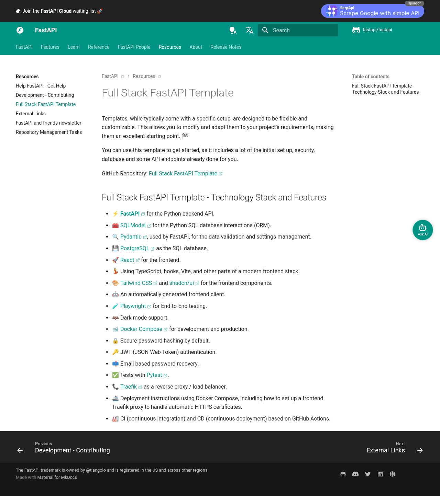

# Visited: https://fastapi.tiangolo.com/project-generation/
**Time:** Wed May  6 11:13:26 UTC 2026

## Screenshot

## Raw HTML
[page.html](./page.html)

## Downloaded Media (0 files)
_No media files downloaded_

## Other Links
- [#full-stack-fastapi-template](#full-stack-fastapi-template)
- [#full-stack-fastapi-template-technology-stack-and-features](#full-stack-fastapi-template-technology-stack-and-features)
- [..](..)
- [../about/](../about/)
- [../advanced/](../advanced/)
- [../advanced/additional-responses/](../advanced/additional-responses/)
- [../advanced/additional-status-codes/](../advanced/additional-status-codes/)
- [../advanced/advanced-dependencies/](../advanced/advanced-dependencies/)
- [../advanced/advanced-python-types/](../advanced/advanced-python-types/)
- [../advanced/async-tests/](../advanced/async-tests/)
- [../advanced/behind-a-proxy/](../advanced/behind-a-proxy/)
- [../advanced/custom-response/](../advanced/custom-response/)
- [../advanced/dataclasses/](../advanced/dataclasses/)
- [../advanced/events/](../advanced/events/)
- [../advanced/generate-clients/](../advanced/generate-clients/)
- [../advanced/json-base64-bytes/](../advanced/json-base64-bytes/)
- [../advanced/middleware/](../advanced/middleware/)
- [../advanced/openapi-callbacks/](../advanced/openapi-callbacks/)
- [../advanced/openapi-webhooks/](../advanced/openapi-webhooks/)
- [../advanced/path-operation-advanced-configuration/](../advanced/path-operation-advanced-configuration/)
- [../advanced/response-change-status-code/](../advanced/response-change-status-code/)
- [../advanced/response-cookies/](../advanced/response-cookies/)
- [../advanced/response-directly/](../advanced/response-directly/)
- [../advanced/response-headers/](../advanced/response-headers/)
- [../advanced/security/](../advanced/security/)
- [../advanced/security/http-basic-auth/](../advanced/security/http-basic-auth/)
- [../advanced/security/oauth2-scopes/](../advanced/security/oauth2-scopes/)
- [../advanced/settings/](../advanced/settings/)
- [../advanced/stream-data/](../advanced/stream-data/)
- [../advanced/strict-content-type/](../advanced/strict-content-type/)
- [../advanced/sub-applications/](../advanced/sub-applications/)
- [../advanced/templates/](../advanced/templates/)
- [../advanced/testing-dependencies/](../advanced/testing-dependencies/)
- [../advanced/testing-events/](../advanced/testing-events/)
- [../advanced/testing-websockets/](../advanced/testing-websockets/)
- [../advanced/using-request-directly/](../advanced/using-request-directly/)
- [../advanced/websockets/](../advanced/websockets/)
- [../advanced/wsgi/](../advanced/wsgi/)
- [../alternatives/](../alternatives/)
- [../assets/_mkdocstrings.css](../assets/_mkdocstrings.css)
- [../assets/javascripts/bundle.79ae519e.min.js](../assets/javascripts/bundle.79ae519e.min.js)
- [../assets/stylesheets/main.484c7ddc.min.css](../assets/stylesheets/main.484c7ddc.min.css)
- [../assets/stylesheets/palette.ab4e12ef.min.css](../assets/stylesheets/palette.ab4e12ef.min.css)
- [../async/](../async/)
- [../benchmarks/](../benchmarks/)
- [../contributing/](../contributing/)
- [../css/custom.css](../css/custom.css)
- [../css/termynal.css](../css/termynal.css)
- [../deployment/](../deployment/)
- [../deployment/cloud/](../deployment/cloud/)

## Stats
- Links: 221
- Media: 0
